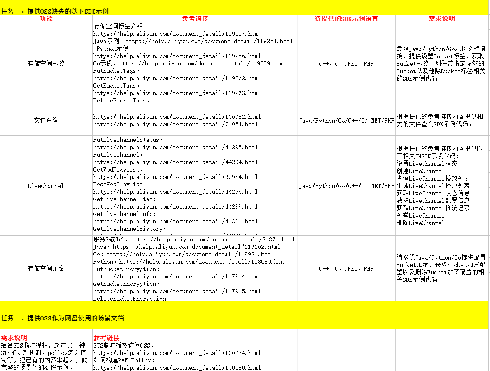

# [OSS文件查询SDK示例Java](https://mvp.aliyun.com/crowdsource/assignment/366)

## 任务说明

## 任务完成情况

### 任务一
|功能|完成情况|demo|
|:---|:---:|:---:|
|文件查询|官网已经提供|[示例代码](https://help.aliyun.com/document_detail/106082.html#h2-url-3)|
|设置LiveChannel状态|yes|[示例代码](src/main/java/samples/PutLiveChannelStatusSamples.java)|
|创建LiveChannel|yes|[示例代码](src/main/java/samples/PutLiveChannelSamples.java)|
|查询LiveChannel播放列表 |yes|[示例代码](src/main/java/samples/GetVodPlaylistSamples.java)|
|生成LiveChannel播放列表 |yes|[示例代码](src/main/java/samples/PostVodPlaylistSamples.java)|
|获取LiveChannel状态信息|yes|[示例代码](src/main/java/samples/GetLiveChannelStatSamples.java)|
|获取LiveChannel配置信息|yes|[示例代码](src/main/java/samples/GetLiveChannelInfoSamples.java)|
|获取LiveChannel推流记录|yes|[示例代码](src/main/java/samples/GetLiveChannelHistorySamples.java)|
|列举LiveChannel|yes|[示例代码](src/main/java/samples/ListLiveChannelSamples.java)|
|删除LiveChannel|yes|[示例代码](src/main/java/samples/DeleteLiveChannelSamples.java)|

             

### 任务二

